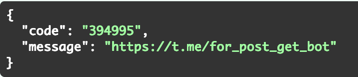
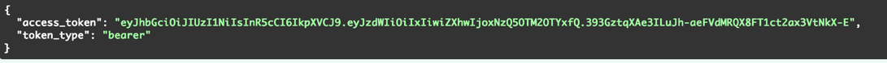
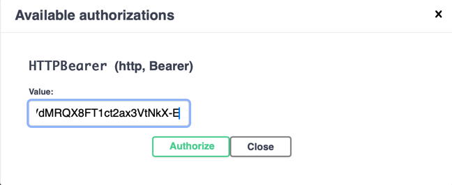

Для конфигурации необходим SECRET_KEY <code>openssl rand -hex 32</code>
Остальное в .env.example

Установка зависимостей <code>pip install -r req.txt</code>

Запуск приложения FastApi
<code>python3 -m src.app.app app.py</code>

Запуск бота
<code>python3 -m src.tg_bot.bot bot.py</code>

В Swagger по endpoint /reg происходит регистрация пользователя: почта и пароль.

Пользователь регистрируется и получает код, который нужно вставить в бота после команды /start 
(Регистрируетесь: почта, пароль 8 символов, копируете код, переходите в бота по ссылке, 
нажимаете команду /start, бот просит ввести код, 
вставляете код и привязываете бота к API).

Заходите в Swagger в endpoint /reg/auth/token, аутентифицируетесь, в ответ получаете токен. 
Копируете и вставляете в Authorize.

Теперь можно добавлять, изменять, удалять посты по соответствующем endpoint.\
Изменения постов происходят по id поста, необходимо получить все посты пользователя по ручке /get. 
Берем id нужного поста, переходим в нужный endpoint, используемый нужный функционал, вводим id поста и подтверждаем.

В боте посты будут доступны по команде /posts.

Админ панель доступна по адресу http://127.0.0.1/admin \
